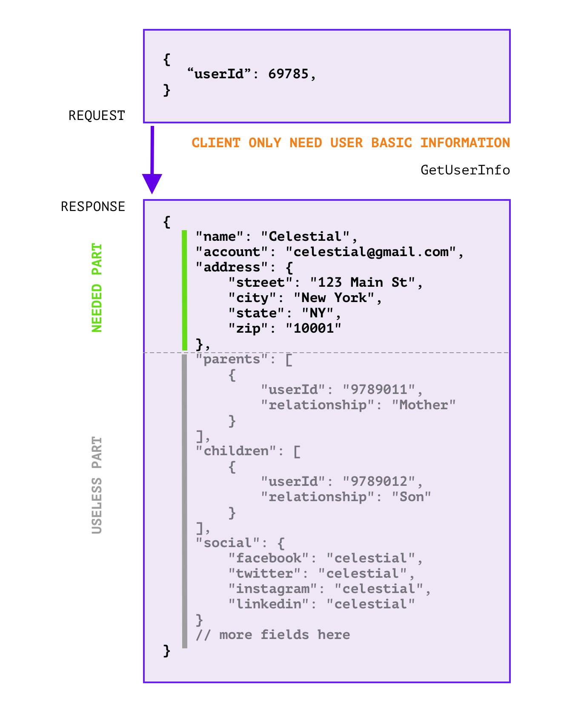
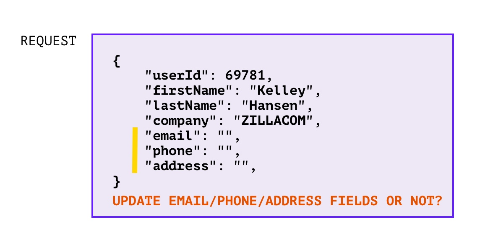

# protoc-gen-fieldmask


[](./LICENSE)

Generate [FieldMask](https://pkg.go.dev/google.golang.org/protobuf/types/known/fieldmaskpb) utilities for protobuf, 
support [Go](https://golang.org), maybe more programing languages later. FieldMask is a protobuf message type, 
it's used to represent a set of fields those should be contained in response, and sent to `Client`. 
It looks like `grapgql` but only takes effect on the server inside calls.

To help developer to avoid repeating codes to deal with `FieldMask` message, this plugin generates a set of utilities to 
deal with `FieldMask` message.

**1. Masking gRPC response case**


<br />

**2. Incremental update case**



### Features

- [x] support field option in `in` message
- [x] generates `Mask_$field` to `in` message type which declare in `in.FieldMask` option.
- [x] generate `FieldMask_Filter` and `FieldMask_Prune` to `in` message, quickly apply field mask.  
- [x] generates `Masked_$field` to `$out_FieldMask` support quickly judge field masking. 
- [x] support mask `in` fields in `incremental updating` case.

### Installation

```sh
go install github.com/yeqwown/protoc-gen-fieldmask@latest
```

### Examples

- [Masking gRPC response fields](./examples/grpc-masked-response/README.md)
- [Incremental updating](examples/grpc-incremental-update/README.md) 

### Usage guide

```sh
protoc \
	-I. \
	-I$YOUR_PROTO_PATH \
	--go_out=paths=source_relative:. \
	--fieldmask_out=paths=source_relative,lang=go:. \
	example.proto
```

### Generated Preview

1. coding proto file [user.proto](./examples/pb/user.proto)：

```protobuf
syntax = "proto3";

import "google/protobuf/field_mask.proto";

message UserInfoRequest {
  string user_id = 1;
  google.protobuf.FieldMask field_mask = 2 [
    // generate MaskIn_XXX and MaskedIn_XXX, xxx are fields in in message (UserInfoRequest). 
    (fieldmask.option.Option).in = {gen: true},
    // generate MaskOut_XXX and MaskedOut_XXX, xxx are fields in out message (UserInfoResponse).
    // Notice that: 
    // 1. you must set message to out message name, and in and out message should in a same proto file.
    // 2. if out message is not specified, it will not generated correctly. 
    (fieldmask.option.Option).out = {gen: true, message:"UserInfoResponse"}
  ];
}

message Address {
  string country = 1;
  string province = 2;
}

message UserInfoResponse {
  string user_id = 1;
  string name = 2;
  string email = 3;
  Address address = 4;
}
```

2. generated [user.pb.go](./examples/pb/user.pb.go), [user.pb.fm.go](./examples/pb/user.pb.fm.go)：

```sh
cd examples && make gen-pb

# or generate them manually
cd examples
protoc \
        -I./pb \
        -I../proto \
        --go_out=paths=source_relative:./pb \
        --fieldmask_out=paths=source_relative,lang=go:./pb \
        ./pb/user.proto
```

3. sample usage codes, on the one hand, to minimize changes to existing code, 
you just omit fields by field mask like this:

```go
func main() {
  req := &normal.UserInfoRequest{
    UserId:    "123123",
    FieldMask: nil,
  }
  
  // enable field mask on specific fields.
  req.MaskOut_Email()
  req.MaskOut_Name()
  
  
  filter := req.FieldMask_Filter()
  // or use prune mode, so clear fields those are masked. 
  // prune := req.FieldMask_Prune()
  
  resp := &normal.UserInfoResponse{
    UserId: "69781",
    Name:   "yeqown",
    Email:  "yeqown@gmail.com",
    Address: &normal.Address{
      Country:  "China",
      Province: "Sichuan",
    },
  }
  
  // makes filter or prune effect on resp.
  prune.Mask(resp)
}
```

on the other hand, you can take FieldMask effect before the `resp` has been filled, 
so that you can ignore unnecessary calculating or remote calls:

```go
func main() {
  req := &normal.UserInfoRequest{
    UserId:    "123123",
    FieldMask: nil,
  }
  
  // enable field mask on specific fields.
  req.MaskOut_Email()
  req.MaskOut_Name()
  
  filter := req.FieldMask_Filter()
  resp := new(normal.UserInfoResponse)
  if filter.Masked_Email() {
    resp.Email = "yeqown@gmail.com"
  }
  if filter.Masked_Name() {
    resp.Name = "yeqown"
  }
}
```

### How to debug

- prepare a `debugdata`
- install `protoc-gen-debug`: `go install github.com/lyft/protoc-gen-star/protoc-gen-debug@latest`
- compile target proto file with `protoc-gen-debug`:

    ```sh
    protoc \
        -I=./examples/normal \
        -I=./proto \
        --plugin=protoc-gen-debug=$(which protoc-gen-debug) \
        --debug_out="./debugdata,lang=go:./debugdata" \
        ./examples/normal/user.proto
    ```
- debug [Test_ForDebug](./internal/module/fieldmask_test.go#L46) test suite
  in [internal/module/fieldmask_test.go](./internal/module/fieldmask_test.go)