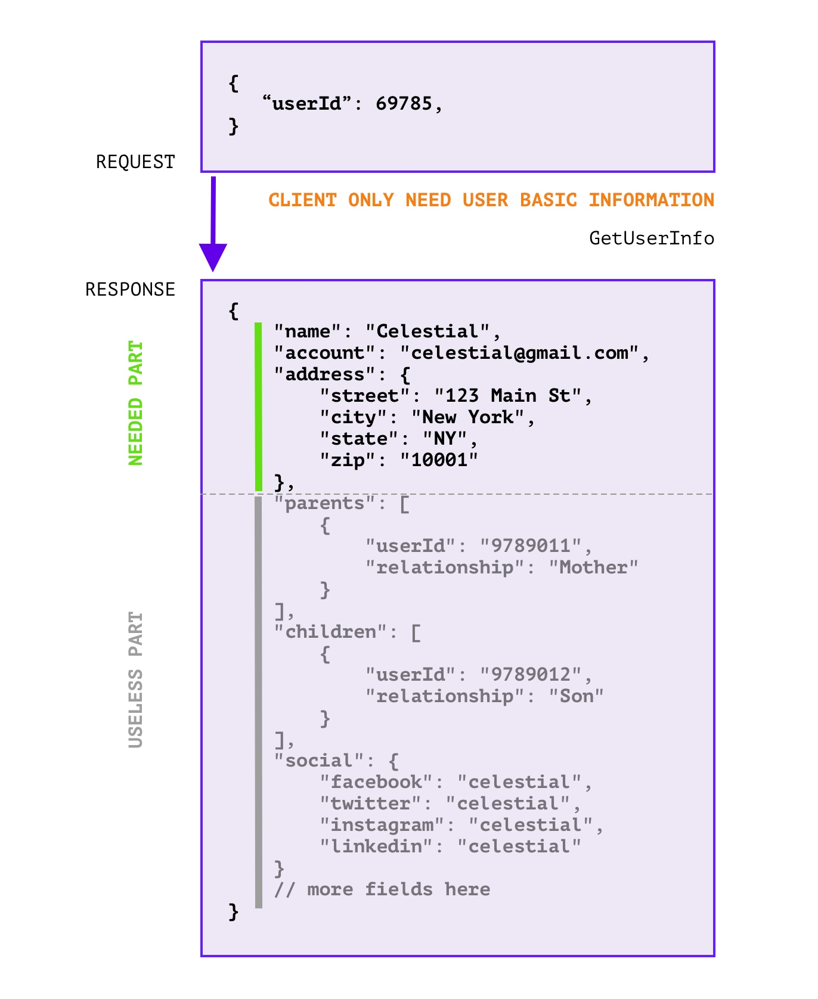
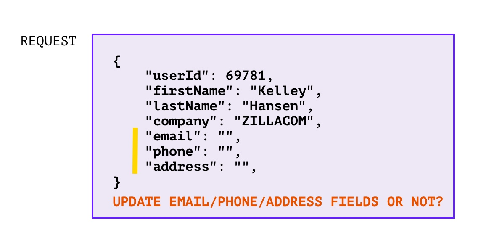

# protoc-gen-fieldmask


[](./LICENSE)

Generate [FieldMask](https://pkg.go.dev/google.golang.org/protobuf/types/known/fieldmaskpb) utilities for protobuf.
Support [Go](https://golang.org) with more programming languages planned.

FieldMask is a protobuf message type used to represent a set of fields that should be contained in a response, sent to the `Client`. It's similar to GraphQL but operates on the server side.

This plugin generates type-safe utilities to deal with `FieldMask` messages, helping developers avoid repetitive code.

## Features

- **Method-level options** - Configure FieldMask behavior per RPC method
- **Field-level options** - Fine-grained control over individual field masking behavior
- **Type-safe API** - Generated `Mask*()` and `Masked*()` methods for compile-time safety
- **Two mask modes**:
  - **FILTER mode** - Only marked fields are included (partial response)
  - **PRUNE mode** - Marked fields are excluded (partial update)
- **Nested message support** - Generate mask methods for nested message types
- **Request/Response separation** - Separate APIs for request and response field masking

## Use Cases

**1. Partial Response (FILTER mode)**


<br />

- Reduce response payload for mobile clients
- Hide sensitive data (passwords, internal fields)
- On-demand field loading based on client needs

**2. Partial Update (PRUNE mode)**



- Incremental updates - only update specified fields
- Prevent accidental modification of protected fields

## Installation

### Install from source

```bash
# Clone the repository
git clone https://github.com/yeqown/protoc-gen-fieldmask.git
cd protoc-gen-fieldmask

# Install the plugin
make install
# or
go install ./cmd/protoc-gen-fieldmask
```

### Install from remote

```bash
go install github.com/yeqown/protoc-gen-fieldmask/cmd/protoc-gen-fieldmask@latest
```

## Quick Start

### 1. Define Your Proto

```protobuf
syntax = "proto3";

package example.user.v1;

import "google/protobuf/field_mask.proto";
import "protoc_gen_fieldmask/option.proto";

service UserService {
  rpc GetUser(GetUserRequest) returns (GetUserResponse) {
    option (protoc_gen_fieldmask.rpc) = {
      field_name: "fm"
      mode: FILTER  // Only marked fields are returned
    };
  }

  rpc UpdateUser(UpdateUserRequest) returns (UpdateUserResponse) {
    option (protoc_gen_fieldmask.rpc) = {
      field_name: "fm"
      mode: PRUNE  // Marked fields are excluded from update
    };
  }
}

message GetUserRequest {
  string user_id = 1 [(protoc_gen_fieldmask.field) = {mask: true}];
  google.protobuf.FieldMask fm = 2;
}

message GetUserResponse {
  string user_id = 1 [(protoc_gen_fieldmask.field) = {mask: true}];
  string name = 2 [(protoc_gen_fieldmask.field) = {mask: true}];
  string email = 3 [(protoc_gen_fieldmask.field) = {mask: true}];
  string password_hash = 4;  // Sensitive - not marked
}

message UpdateUserRequest {
  string user_id = 1;
  string name = 2 [(protoc_gen_fieldmask.field) = {mask: true}];
  string email = 3 [(protoc_gen_fieldmask.field) = {mask: true}];
  google.protobuf.FieldMask fm = 4;
}

message UpdateUserResponse {
  string user_id = 1 [(protoc_gen_fieldmask.field) = {mask: true}];
  string name = 2 [(protoc_gen_fieldmask.field) = {mask: true}];
  string email = 3 [(protoc_gen_fieldmask.field) = {mask: true}];
}
```

### 2. Generate Code

```bash
protoc \
  -I. \
  -I$YOUR_PROTO_PATH \
  --go_out=paths=source_relative:. \
  --fieldmask_out=paths=source_relative,lang=go:. \
  example.proto
```

This generates:
- `example.pb.go` - Standard protobuf generated code
- `example.pb.fm.go` - FieldMask utility code

### 3. Use the Generated API

**Client side (Partial Response):**

```go
req := &GetUserRequest{UserId: "user123"}

// Mark which fields you want in the response
fm := req.FieldMask().Response()
fm.MaskUserId()
fm.MaskName()
// email and password_hash are not marked, so they won't be returned

// Call RPC
resp, _ := client.GetUser(ctx, req)
// resp contains only user_id and name
```

**Server side (Partial Response):**

```go
func (s *Server) GetUser(ctx context.Context, req *GetUserRequest) (*GetUserResponse, error) {
  // Build full response
  resp := &GetUserResponse{
    UserId:       user.Id,
    Name:         user.Name,
    Email:        user.Email,
    PasswordHash: "secret",  // Sensitive data
  }

  // Apply field mask - only marked fields are kept
  req.FieldMask().Response().Apply(resp)

  return resp, nil
}
```

**Client side (Partial Update):**

```go
req := &UpdateUserRequest{
  UserId: "user123",
  Name:   "new_name",
  Email:  "should_not_change@example.com",
}

// Mark which fields to update
fm := req.FieldMask().Request()
fm.MaskName()  // Only name will be updated
// Email is not marked, so it won't be updated

// Call RPC
resp, _ := client.UpdateUser(ctx, req)
```

**Server side (Partial Update):**

```go
func (s *Server) UpdateUser(ctx context.Context, req *UpdateUserRequest) (*UpdateUserResponse, error) {
  user, _ := s.getUserFromStore(req.UserId)
  fm := req.FieldMask()

  // Update only marked fields
  if fm.Request().MaskedName() {
    user.Name = req.Name
  }
  // Email is not checked/updated because it wasn't marked

  return &UpdateUserResponse{...}, nil
}
```

## API Reference

### Method Options

Configure FieldMask behavior on RPC methods:

```protobuf
rpc Method(Request) returns (Response) {
  option (protoc_gen_fieldmask.rpc) = {
    field_name: "fm";      // FieldMask field name in Request (default: "fm")
    mode: FILTER;          // FILTER or PRUNE (default: FILTER)
  };
}
```

### Field Options

Configure individual field behavior:

```protobuf
message Message {
  // Generate mask methods for this field
  string field_name = 1 [(protoc_gen_fieldmask.field) = {mask: true}];

  // Generate mask methods for this nested message type
  NestedMessage nested = 2 [(protoc_gen_fieldmask.field) = {mask: true, nested: true}];
}
```

### Generated Methods

For each message with FieldMask:

```go
// Get the FieldMask controller
func (x *Request) FieldMask() *Method_FieldMask

// Access request/response mask controllers
func (fm *Method_FieldMask) Request() *Method_Req
func (fm *Method_FieldMask) Response() *Method_Res

// Mark fields (Request - for partial update)
func (r *Method_Req) MaskFieldName()
func (r *Method_Req) MaskNested_FieldName()

// Mark fields (Response - for partial response)
func (r *Method_Res) MaskFieldName()
func (r *Method_Res) MaskNested_FieldName()

// Check if fields are marked
func (r *Method_Req) MaskedFieldName() bool
func (r *Method_Res) MaskedFieldName() bool

// Apply mask to response message
func (r *Method_Res) Apply(resp proto.Message)
```

## Examples

See the [examples](./examples/) directory for complete working examples:

- **[complete/](./examples/complete/)** - End-to-end demonstration with all scenarios
- **[proto/](./examples/proto/)** - Proto definitions used in examples

Run the complete example:

```bash
cd examples/complete
go run .
```

## Mask Modes

### FILTER Mode (Partial Response)

**Use when:** Client wants to specify which fields to include in response

**Behavior:**
- Client marks fields they want
- Server returns only marked fields
- Unmarked fields are cleared (set to zero/empty)

**Example:**
```go
// Mobile client - only needs ID and name
fm.Response().MaskUserId()
fm.Response().MaskName()
// Result: Only user_id and name are returned
```

### PRUNE Mode (Partial Update)

**Use when:** Client wants to specify which fields to update

**Behavior:**
- Client marks fields they want to update
- Server updates only marked fields
- Unmarked fields are left unchanged

**Example:**
```go
// Update only name and email
fm.Request().MaskName()
fm.Request().MaskEmail()
// Result: Only name and email are updated
```

## Nested Messages

Generate mask methods for nested message types:

```protobuf
message Address {
  string country = 1 [(protoc_gen_fieldmask.field) = {mask: true}];
  string province = 2 [(protoc_gen_fieldmask.field) = {mask: true}];
}

message GetUserResponse {
  string user_id = 1 [(protoc_gen_fieldmask.field) = {mask: true}];
  Address address = 2 [(protoc_gen_fieldmask.field) = {mask: true, nested: true}];
}
```

Usage:

```go
fm.Response().MaskAddress()
fm.Response().MaskAddress_Country()
fm.Response().MaskAddress_Province()
```

## Debugging

To debug code generation:

1. Install `protoc-gen-debug`:
   ```bash
   go install github.com/lyft/protoc-gen-star/protoc-gen-debug@latest
   ```

2. Generate debug data:
   ```bash
   make prepare-debug
   # or manually:
   protoc \
     -I=./examples/pb \
     -I=./proto \
     --plugin=protoc-gen-debug=$(which protoc-gen-debug) \
     --debug_out="./internal/module/debugdata:." \
     ./examples/pb/user.proto
   ```

3. Run debug test:
   ```bash
   go test -v ./internal/module -run Test_ForDebug
   ```

## License

[MIT](./LICENSE)
